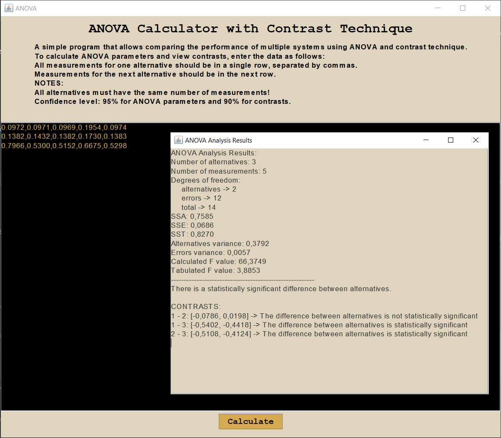

# ANOVA Calculator with Contrast Technique

## Project Overview

This project is a desktop application for statistical comparison of multiple alternatives such as systems, algorithms, and others. Each alternative is represented by a series of numerical measurements. The program applies **ANOVA (Analysis of Variance)** to determine whether there are statistically significant differences among the group averages. Since **ANOVA** only shows that differences exist without indicating where, the program also performs **contrast analysis** to identify the exact pairs of alternatives with significant differences.

The application is implemented in Java with a Swing graphical interface, providing an intuitive environment for entering data, running calculations and reviewing statistical results.

## Key Features

- **Input of Data:**  
  Any number of alternatives can be entered. Each alternative has the same number of measurements, representing experimental or performance results.

- **ANOVA Calculation:**  
  The program applies a ANOVA procedure. It calculates sum of squares, degrees of freedom, computed F-value and tabulated F-value. The F-test is then used to determine whether there are statistically significant differences between the alternatives.
 
- **F-Test for Significance:**  
  If the calculated F-value is larger than the tabulated F-value at the chosen confidence level (95%), the program concludes that there is a statistically significant difference among the alternatives. Otherwise, it concludes that no significant differences exist.

- **Contrast Analysis:**  
  Since ANOVA only tells us that a difference exists but not where, the program performs pairwise contrasts. For every pair of alternatives, it computes the estimated difference of means, a confidence interval (90%) for the difference and an interpretation of whether the difference is statistically significant. A difference is considered statistically significant if the confidence interval does not include zero. This allows the user to identify exactly which alternatives differ in performance.

- **Detailed Output:**  
  Results are presented in a structured text report, including:
  - number of alternatives
  - number of measurements
  - degrees of freedom
  - SSA (Sum of Squares for Alternatives)
  - SSE (Sum of Squares for Error)
  - SST (Total Sum of Squares)
  - alternatives variance
  - error variance
  - calculated F value
  - tabulated f value
  - overall conclusion on whether significant differences exist
  - list of pairwise contrasts with confidence intervals and interpretations

- **Graphical User Interface (GUI):**  
  GUI is built with Java Swing and allows easy entry of alternatives (each row is one group, values separated by commas). Results appear in a separate window after clicking the *Calculate* button.

## Program Demonstration

Below is screenshot showcasing the application in action:

### How to Use the Program

1. Open the project in **IntelliJ IDEA**.  
2. Run the application by executing the **Main** class.  
3. Enter the measurements for each alternative in separate rows.  
4. Click *Calculate* to perform the ANOVA and contrast analysis.  
5. Review the detailed results in the output window.  
